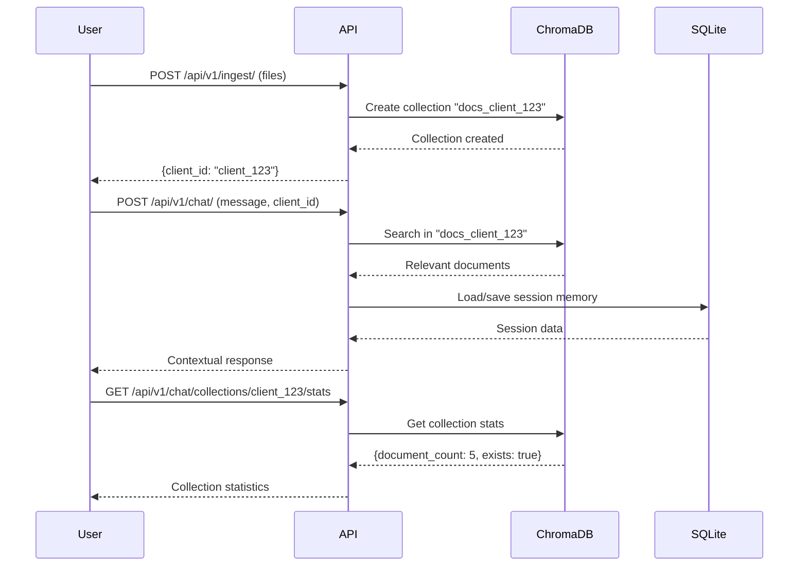

# Multi-Tenant Conversational RAG System with SQLite Session Storage

A production-ready multi-tenant conversational Retrieval-Augmented Generation (RAG) system built with FastAPI, LangChain, and Groq API, featuring client-specific document collections and persistent SQLite session storage.

## 🚀 Key Features

### Multi-Tenant Architecture
- **Client-Specific Collections**: Complete document isolation per client using auto-generated client IDs
- **Auto Client ID Generation**: UUID-based client identification for seamless user onboarding
- **Document Isolation**: Each client's documents are stored in separate ChromaDB collections
- **Collection Management**: Full CRUD operations for client collections

### Core Functionality
- **Conversational RAG**: Context-aware document retrieval and generation with memory
- **Groq API Integration**: Fast LLM inference with llama-3.3-70b-versatile
- **ChromaDB Vector Store**: Semantic document search with HuggingFace embeddings
- **File Upload API**: Direct file upload support for PDF, TXT, DOCX, DOC, and Markdown files

### Session Management
- **SQLite Persistence**: Production-ready session storage with ACID compliance
- **Memory Integration**: LangChain memory with automatic persistence
- **Session Analytics**: Comprehensive statistics and monitoring
- **Cleanup Automation**: Automatic expired session removal

### Production Features
- **Cost Optimized**: $0 hosting cost with embedded SQLite
- **Thread Safe**: Concurrent user support with connection pooling
- **Error Resilient**: Comprehensive error handling and fallbacks
- **RESTful API**: Organized endpoints with proper prefixes and documentation tags

## 📁 Project Structure

```
conversational_rag/
├── app/
│   ├── common/
│   │   ├── file_loader.py       # Document loading utilities (PDF, TXT, DOCX, DOC, MD)
│   │   └── logger.py            # Logging configuration
│   ├── memory/
│   │   ├── __init__.py          # Session store interface
│   │   └── sqlite_session_store.py  # SQLite session storage (production)
│   ├── routers/
│   │   ├── chat.py              # Chat endpoints (/api/v1/chat)
│   │   ├── ingest.py            # Document upload endpoints (/api/v1/ingest)
│   │   └── sessions.py          # Session management (/api/v1/sessions)
│   ├── schemas/
│   │   ├── chat.py              # Chat data models with client_id support
│   │   └── ingest.py            # File upload and ingestion models
│   ├── services/
│   │   ├── rag_chain.py         # Main RAG implementation with client isolation
│   │   ├── retriever.py         # Client-specific document retrieval
│   │   └── vector_store.py      # ChromaDB with client collections
│   ├── config.py                # Application configuration
│   └── main.py                  # FastAPI application with organized routes
├── data/
│   └── sessions.db              # SQLite session database
├── chroma_db/                   # Vector store data (client collections)
├── .env                         # Environment configuration
├── requirements.txt             # Python dependencies
└── README.md                    # This file
```

## 🛠 Installation

### 1. Clone and Setup
```bash
git clone <your-repo>
cd conversational_rag
pip install -r requirements.txt
```

### 2. Environment Configuration
Create a `.env` file:
```env
# LLM API Keys
GROQ_API_KEY=your_groq_api_key_here

# LLM Settings
MODEL_NAME=llama-3.3-70b-versatile
TEMPERATURE=0.7

# Vector Store Settings
VECTOR_STORE_TYPE=chroma
VECTOR_STORE_PATH=./chroma_db

# Memory Settings
MEMORY_TYPE=buffer
MAX_TOKEN_LIMIT=2000

# Session Storage Settings (SQLite Only)
SESSION_STORE_TYPE=sqlite
SESSION_DB_PATH=./data/sessions.db
SESSION_TTL=3600

# Production Settings
MAX_CACHED_SESSIONS=100
CLEANUP_INTERVAL=300
```

### 3. Start the Application
```bash
python -m uvicorn app.main:app --host 0.0.0.0 --port 8000
```

## 📚 API Endpoints

The API is organized with logical prefixes for better developer experience:

### Chat Endpoints (`/api/v1/chat`)
```bash
# Send a chat message (requires client_id)
POST /api/v1/chat/
{
  "message": "What does my document say about machine learning?",
  "client_id": "client_a1b2c3d4",  # Required - get from document upload
  "session_id": "optional-session-id",
  "use_memory": true
}

# Response with client-specific context
Response: {
  "response": "Based on your document, machine learning is...",
  "session_id": "uuid-session-id",
  "client_id": "client_a1b2c3d4",
  "sources": [{"page": 1, "content": "..."}],
  "memory_used": true
}

# Clear specific session
DELETE /api/v1/chat/{session_id}

# List all client collections
GET /api/v1/chat/collections
Response: {
  "collections": [
    {"client_id": "client_123", "document_count": 5},
    {"client_id": "client_456", "document_count": 3}
  ],
  "total": 2
}

# Get client collection statistics
GET /api/v1/chat/collections/{client_id}/stats
Response: {
  "client_id": "client_123",
  "collection_name": "docs_client_123",
  "exists": true,
  "document_count": 5,
  "last_modified": 1753948512.5172725
}

# Delete client collection completely
DELETE /api/v1/chat/collections/{client_id}
```

### Document Upload (`/api/v1/ingest`)
```bash
# Upload documents with multipart form data
POST /api/v1/ingest/
Content-Type: multipart/form-data

Form fields:
- files: [file1.pdf, file2.txt, file3.docx]  # Multiple files supported
- client_id: "optional-existing-client-id"   # Optional
- chunk_size: 1000                           # Optional
- chunk_overlap: 200                         # Optional

# Response with auto-generated or provided client_id
Response: {
  "message": "Documents ingested successfully for client client_a1b2c3d4",
  "documents_processed": 3,
  "chunks_created": 15,
  "client_id": "client_a1b2c3d4"  # Use this for chat requests
}

# Supported file types: PDF, TXT, DOCX, DOC, MD
```

### Session Management (`/api/v1/sessions`)
```bash
# Get comprehensive session statistics
GET /api/v1/sessions/stats
Response: {
  "active_chains": 5,
  "total_sessions": 25,
  "active_sessions": 10,
  "total_messages": 150,
  "database_size_mb": 2.5
}

# List all active sessions
GET /api/v1/sessions/list
Response: ["session-id-1", "session-id-2", ...]

# Get detailed session information
GET /api/v1/sessions/{session_id}/info
Response: {
  "session_id": "uuid",
  "message_count": 12,
  "created_at": 1234567890,
  "is_expired": false
}

# Clear specific session
DELETE /api/v1/sessions/{session_id}

# Cleanup expired sessions manually
POST /api/v1/sessions/cleanup
Response: {
  "message": "Expired sessions cleaned up successfully",
  "current_stats": {...}
}
```

### Health Check
```bash
GET /health
Response: {
  "status": "healthy",
  "timestamp": 1753948512.517,
  "model": "llama-3.3-70b-versatile",
  "vector_store": "chroma",
  "session_storage": "sqlite",
  "database_path": "./data/sessions.db"
}
```

## 🏗️ Multi-Tenant Architecture

### Client Isolation Workflow



### Key Benefits

1. **Complete Isolation**: Each client's documents are stored in separate ChromaDB collections
2. **Auto Client ID**: UUID-based client identification (`client_a1b2c3d4`)
3. **Scalable**: Supports thousands of clients with minimal overhead
4. **Session Persistence**: SQLite stores conversation history per client
5. **Collection Management**: Full CRUD operations for client collections

## 🗄️ SQLite Session Storage

### Database Schema
```sql
-- Sessions table
CREATE TABLE sessions (
    session_id TEXT PRIMARY KEY,
    created_at REAL NOT NULL,
    last_accessed REAL NOT NULL,
    expires_at REAL NOT NULL,
    message_count INTEGER DEFAULT 0
);

-- Messages table
CREATE TABLE messages (
    id INTEGER PRIMARY KEY AUTOINCREMENT,
    session_id TEXT NOT NULL,
    role TEXT NOT NULL,
    content TEXT NOT NULL,
    timestamp REAL NOT NULL,
    FOREIGN KEY (session_id) REFERENCES sessions (session_id)
        ON DELETE CASCADE
);
```

### Features
- **ACID Compliance**: Guaranteed data consistency
- **Thread Safety**: Concurrent access support
- **Automatic Indexing**: Optimized query performance
- **Cascade Deletion**: Clean session removal
- **Expiration Management**: Automatic cleanup

### Performance
- **10,000+ sessions**: Handles easily with sub-millisecond queries
- **Concurrent Users**: 100+ simultaneous users supported
- **Storage Efficiency**: ~1-10MB for thousands of sessions
- **Zero Cost**: No external database hosting required

## 🔧 Configuration Options

### Client Collection Management
The system automatically manages client-specific collections:
```env
# Vector store automatically creates collections per client:
# - docs_client_a1b2c3d4
# - docs_client_b2c3d4e5
# - docs_default (fallback)
VECTOR_STORE_PATH=./chroma_db
```

### Session Storage (SQLite Only)
Production-ready SQLite session storage:
```env
# SQLite session storage (production ready)
SESSION_STORE_TYPE=sqlite
SESSION_DB_PATH=./data/sessions.db
SESSION_TTL=3600  # Session expiration in seconds
```

### Memory Types
Configure LangChain memory behavior:
```env
# Buffer memory (stores all messages)
MEMORY_TYPE=buffer

# Summary memory (summarizes old messages)
MEMORY_TYPE=summary

# Buffer window (keeps last N messages)
MEMORY_TYPE=buffer_window
```

### File Upload Settings
```env
# Supported file types: PDF, TXT, DOCX, DOC, MD
# Max file size handled by FastAPI settings
# Chunk settings configurable per request
```

## 🚀 Production Deployment

### Docker Deployment
```dockerfile
FROM python:3.11-slim

WORKDIR /app
COPY requirements.txt .
RUN pip install -r requirements.txt

COPY . .
EXPOSE 8000

CMD ["uvicorn", "app.main:app", "--host", "0.0.0.0", "--port", "8000"]
```

### Docker Compose
```yaml
version: '3.8'
services:
  rag-api:
    build: .
    ports:
      - "8000:8000"
    volumes:
      - ./data:/app/data
      - ./chroma_db:/app/chroma_db
    environment:
      - GROQ_API_KEY=${GROQ_API_KEY}
```

### Production Considerations
- **Volume Mounting**: Persist `./data/` and `./chroma_db/` directories
- **Environment Variables**: Use secrets management for API keys
- **Load Balancing**: Sticky sessions recommended for SQLite file locks
- **Backup Strategy**: Regular SQLite database backups
- **Monitoring**: Track session stats, database size, and collection counts
- **Client Management**: Monitor collection sizes and implement cleanup policies

## 📊 Monitoring & Analytics

### Session Statistics
```python
# Get comprehensive statistics
stats = session_store.get_stats()
print(f"Active Sessions: {stats['active_sessions']}")
print(f"Database Size: {stats['database_size_mb']} MB")
print(f"Average Messages: {stats['avg_messages_per_session']}")
```

### Client Collection Metrics
```python
# Monitor client collections
collections = vector_store_service.list_client_collections()
for collection in collections:
    print(f"Client {collection['client_id']}: {collection['document_count']} documents")
```

### Performance Metrics
- Response time tracking in logs
- Session creation/cleanup events
- Database query performance
- Memory usage monitoring
- Collection size tracking
- File upload statistics

## 🔍 Troubleshooting

### Common Issues
1. **Database Locked**: Ensure proper connection cleanup
2. **Memory Leaks**: Monitor cached sessions count
3. **Slow Queries**: Check database indexes
4. **Disk Space**: Monitor database file size and collection counts
5. **Client ID Missing**: Ensure documents are uploaded before chat
6. **Collection Not Found**: Check if collection was deleted or client ID is correct
7. **File Upload Errors**: Verify file types and sizes

### Debug Mode
Enable verbose logging:
```env
LOG_LEVEL=DEBUG
```

### Client Collection Issues
```bash
# Check if client collection exists
GET /api/v1/chat/collections/{client_id}/stats

# List all collections
GET /api/v1/chat/collections

# Re-upload documents if collection was deleted
POST /api/v1/ingest/ (with files)
```

## 🤝 Contributing

1. Fork the repository
2. Create a feature branch
3. Make changes with tests
4. Submit a pull request

## 📄 License

This project is licensed under the MIT License.

## 🙏 Acknowledgments

- **LangChain**: Conversational AI framework with memory management
- **Groq**: High-performance LLM inference API
- **ChromaDB**: Vector database for embeddings and document storage
- **FastAPI**: Modern Python web framework with automatic API documentation
- **SQLite**: Embedded database engine for session persistence
- **HuggingFace**: Transformer models and embeddings
